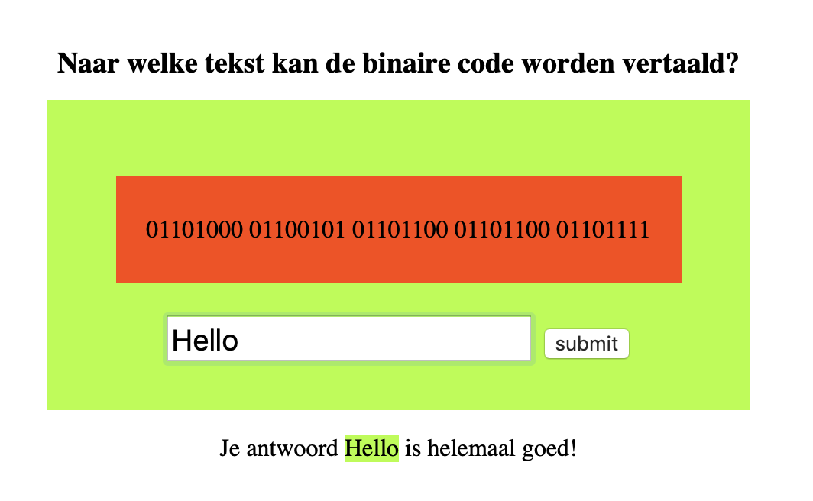

# Casustoets

- naam:
- starttijd: 13.00 uur
- eindtijd: 16.00 uur
- hulpmiddelen: internet, huiswerk en voorbeelden uit les. Het is uitdrukkelijk verboden om sociale media in te zetten en contact te zoeken met anderen.
- eigenaarschap: de code die je hebt opgeleverd is door jou ontwikkeld.
- inleveren: lever via learn een .zip bestand in van al je bestanden.

## Casusomschrijving


Maak een leeromgeving die een gebruiker leert om binary reeksen om te zetten naar een woord of zin in het Nederlands. De applicatie werkt als volgt. Als je de applicatie opent, toont hij een stuk binary code en een invoerformulier. In het invoerveld vul je dan het antwoord in. Als je op submit drukt, vergelijkt de applicatie het ingevoerde antwoord met het daadwerkelijke antwoord. Als het antwoord goed is, verschijnt: 'Je antwoord {ingevoerde antwoord} is helemaal goed'. Tevens verandert de achtergrond van de container naar groen en verandert de achtergrond van het {ingevoerde woord} ook naar groen. Als het antwoord fout is, verschijnt: 'Helaas {ingevoerde antwoord} is niet juist, probeer het nog eens'. Tevens verandert de achtergrond van de container naar rood en verandert de achtergrond van het {ingevoerde woord} ook naar rood. Wanneer het goede antwoord is gegeven, wordt er een nieuwe (random) vraag getoond.

De HTML en CSS voor deze opdracht is gegeven en staat in de map 'start'.

Implementeer daarbij de volgende 4 vragen en antwoorden door middel van een array met objecten.

```
Vraag 1:  
Vraag: '01101000 01100101 01101100 01101100 01101111'  
Antwoord: 'Hello'

Vraag 2:  
Vraag: '01010111 01100101 01101100 01101011 01101111 01101101'  
Antwoord: 'Welkom'

Vraag 3:  
Vraag: '01010100 01101111 01110100 00100000 01111010 01101001 01100101 01101110 01110011'  
Antwoord: 'Tot ziens'

Vraag 4:  
Vraag: '01000111 01110010 01101111 01100101 01110100 01101010 01100101 01110011
Antwoord: 'Groetjes'
```

## Nakijkcriteria

1. Je mag geen jQuery gebruiken, alleen native JavaScript. Wanneer er wel jQuery wordt gebruikt dan wordt de opdracht niet nagekeken.
2. Je applicatie wordt alleen nagekeken op het moment dat de waarde uit het invoerveld wordt vergeleken met het antwoord en er een bericht wordt geschreven naar de DOM.
3. Je kunt voor de 10 gaan door de opdracht volledig af te maken.

## Beoordelingscriteria

Nr | Leeropbrengsten | Punten
---|---|---
1 | Gebruikt consistente naamgeving | 5
2 | Gebruikt const, let, var in de gevraagde situatie | 5
3 | Gebruikt array's om data in op te slaan | 5
4 | Gebruikt een conditional (if else)| 10
5 | Gebruikt een loop om herhaling van stappen te voorkomen | 10
6 | Schrijft een functie om code te structureren | 10
7 | Schrijft een functie om herhaling te voorkomen | 5
8 | Schrijft commentaar volgens de JS docs richtlijnen | 5
9 | Gebruikt de juiste operatoren bij vergelijkingen | 5
10 | Gebruikt console.log om te debuggen | 5
11 | Gebruikt een object om gestructureerde data in op te slaan | 5
12 | Gebruikt Events voor interactie | 10
13 | Gebruikt DOM methods (interfaces) om HTML elementen te maken en te plaatsen in het DOM | 10
14 | Gebruikt DOM methods (interfaces) methoden om door de DOM te wandelen | 10

## Puntenverdeling

Beoordeling | Cijfer | Aantal punten
---|---|---
onvoldoende | 4 | < 60
matig | 5 | 60 tot 70
voldoende | 6 | 70 tot 80
ruim voldoende | 7 | 80 tot 85
goed | 8 | 85 - 90
zeer goed | 9 | 90 - 95
uitmuntend | 10 | 95 - 100